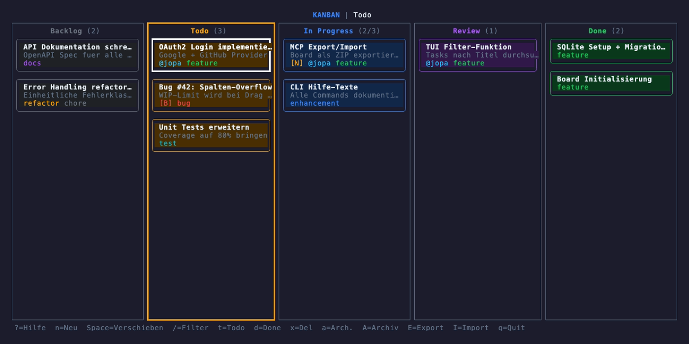
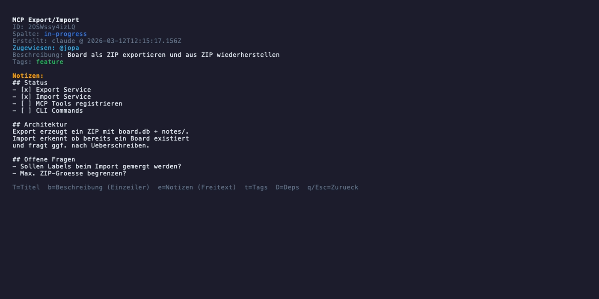

# kanban-mcp

Terminal-basiertes Kanban Board mit MCP-Server fuer Claude Code.

- **CLI** — Alle Board-Operationen direkt im Terminal
- **TUI** — Interaktive Board-Ansicht mit Tastatur-Navigation
- **MCP Server** — 19 Tools fuer Claude Code Integration
- **Skills** — Automatisierte Review-Tests (Playwright + VHS)
- **SQLite** — Pro-Projekt Datenbank in `.kanban/`

## Screenshots





## Voraussetzungen

**[Bun](https://bun.sh) >= 1.2 ist zwingend erforderlich — kein Node.js.**
Das Paket nutzt `bun:sqlite` und `Bun.$` direkt; ohne Bun startet weder die
CLI noch der MCP-Server, und die Fehlermeldung dabei laesst nicht ohne
Weiteres erkennen, dass schlicht die falsche Runtime laeuft.

```bash
curl -fsSL https://bun.sh/install | bash
```

## Installation

Das Projekt liegt nicht auf npm — Installation direkt aus dem Repository.

**Global installieren** (fuer `kanban` als dauerhaftes Kommando im PATH):

```bash
bun install -g github:jopa79/kanban-mcp
kanban init
```

**Eine bestimmte Version**:

```bash
bun install -g github:jopa79/kanban-mcp#v0.2.0
```

**Aus dem Quellcode** (zum Mitentwickeln am Projekt selbst):

```bash
git clone https://github.com/jopa79/kanban-mcp.git
cd kanban-mcp
bun install

# Board im aktuellen Verzeichnis initialisieren
bun run src/index.ts init

# Optional: Board-Name angeben
bun run src/index.ts init "Mein Projekt"
```

Alle Beispiele unten verwenden `kanban ...` (nach globaler Installation oder
via `bunx`). Wer aus dem Quellcode arbeitet, ersetzt das durch
`bun run src/index.ts ...`.

## Migration von 0.1.x auf 0.2.0

**Ein bestehendes Board mit Schema-Version < 3 verweigert ab 0.2.0 jeden
Zugriff, bis es migriert ist** — CLI, TUI, MCP und `kanban export` brechen
einheitlich ab und nennen den noetigen Befehl. Wer das nicht liest, haelt das
Werkzeug fuer kaputt, obwohl nur ein einmaliger Migrationsschritt fehlt.

```bash
kanban migrate            # Vorschau: Ist-Version, Ziel-Version, geplante Schritte
kanban migrate --dry-run  # dasselbe, ohne im Anschluss nach --yes zu fragen
kanban migrate --yes      # fuehrt die Migration tatsaechlich aus
```

Vor jeder Migration entsteht automatisch ein Backup (`.kanban/board.db.bak-v2`,
per `VACUUM INTO`, WAL-sicher) — es wird nie ueberschrieben, sondern bei
erneutem Lauf zeitgestempelt ergaenzt. Migriert werden die Spalten aus der
alten `columns`-Tabelle nach `.kanban/config.json` (Hintergrund:
`docs/decisions/0001-spalten-in-config-statt-datenbank.md`); die ersten beiden
Spalten werden dabei zu Eintrittsspalten, danach in `config.json` anpassbar.

## CLI Commands

```bash
# Task erstellen -- nur Backlog/Todo sind Eintrittsspalten (Zustandsmaschine, 0.2.0)
kanban add "Task Titel" -d "Beschreibung" -c backlog

# Tasks auflisten
kanban list                  # Alle Tasks
kanban list -c todo          # Nur aus Todo-Spalte
kanban list --priority high  # Nach Prioritaet filtern
kanban list --overdue        # Nur ueberfaellige Tasks
kanban list --sort priority  # high vor medium vor low vor ohne Prioritaet

# Task verschieben / abschliessen -- die Spaltenkette ist vorwaerts strikt
# (max. ein Schritt), rueckwaerts frei; done braucht Review davor
kanban move <id> in-progress
kanban done <id>

# --by <name> an add/move/done: wer meldet die Aenderung (default: user).
# Wird in transitions.reported_by protokolliert, nicht auf dem Task selbst.
kanban move <id> in-progress --by backend

# Prioritaet und Faelligkeit -- echte, sortierbare Spalten (kein Label: nur
# eine Spalte hat eine Ordnung). Werden nie automatisch gesetzt (auch nicht
# vom Sync), nur von Hand ueber CLI/MCP/TUI
kanban add "Task Titel" -p high --due 2026-08-01
kanban update <id> -p low --due 2026-12-25

# Task aendern / loeschen
kanban update <id> -t "Neuer Titel"
kanban delete <id>

# Board-Status (Spalten, Waisen, Groesse der Transitions-Historie)
kanban status

# Bestehendes Board auf Schema v3 heben (siehe Migration oben)
kanban migrate --yes

# Archiv
kanban archive              # Done-Tasks archivieren
kanban restore <id>         # Wiederherstellen
kanban purge --confirm      # Archiv loeschen
```

## Mehrere Boards

`kanban init` traegt ein Board automatisch in eine globale Registry ein
(`~/.config/kanban/registry.json`, `--no-register` schaltet das ab). Damit
laesst sich der Ueberblick behalten, ohne jedes Projektverzeichnis einzeln
aufzusuchen:

```bash
kanban boards              # Uebersicht: Name, Pfad, Task-Zahl je Board
kanban boards --json       # dieselbe Uebersicht maschinenlesbar
kanban boards add [pfad]   # bestehendes Board nachtraeglich eintragen (Default: cwd)
kanban boards remove <pfad>  # Eintrag entfernen (loescht kein Board)
```

Ein kaputtes Board (fehlender Pfad, kaputte `config.json`, nicht migriertes
Schema, gesperrte Datenbank) zeigt eine Warnzeile statt die Uebersicht der
anderen Boards zu verhindern. **Bewusst nicht ueber MCP verfuegbar** — die
Registry ist ein CLI-/TUI-Komfort fuer Menschen, kein Werkzeug fuer Agents,
die ohnehin im aktuellen Arbeitsverzeichnis operieren.

## TodoWrite Sync (Claude Code Hook)

`kanban sync` liest den TodoWrite-Hook-Payload von stdin und gleicht ihn mit
dem Board ab. Als `PostToolUse`-Hook fuer `TodoWrite` in `~/.claude/settings.json`
registrieren:

```json
{
  "hooks": {
    "PostToolUse": [
      { "matcher": "TodoWrite", "hooks": [{ "type": "command", "command": "kanban sync" }] }
    ]
  }
}
```

**Verhalten:**
- Todos werden per **Titel-Vergleich** mit bestehenden Tasks abgeglichen
  (TodoWrite liefert keine ID, siehe Einschraenkung unten). Bei mehreren
  gleichnamigen Tasks gewinnt deterministisch der **aelteste, nicht
  archivierte** — archivierte Tasks werden nie getroffen, und zwei
  gleichnamige Todos im selben Aufruf landen auf zwei verschiedenen Tasks
- Ein Todo meldet einen **Zielzustand**, keinen Weg dorthin. Liegt die
  Zielspalte mehr als einen Schritt entfernt (z.B. ein neuer, sofort
  `completed` gemeldeter Todo), durchlaeuft der Task jede Zwischenspalte als
  eigene, protokollierte Transition (`reason: "reconcile"`, `reportedBy:
  "sync"`) — die Zustandsmaschine wird nicht umgangen, auch wenn alle
  Zwischenschritte in derselben Sekunde passieren
- **WIP-Ueberschreitungen werden protokolliert, nicht abgelehnt** (TodoWrite
  selbst laesst sich nicht ablehnen — der Hook laeuft, nachdem Claude Code den
  Zustand bereits gesetzt hat). Meldung auf stderr, `kanban status` zeigt die
  ueberfuellte Spalte
- Ist der zugehoerige Task durch eine **offene Abhaengigkeit blockiert**, wird
  das Todo **uebersprungen** statt bewegt — anders als beim WIP-Limit, das der
  Sync reissen darf, ist eine offene Abhaengigkeit eine Tatsache: der Task ist
  noch nicht dran. Meldung auf stderr nennt Task und wartende Abhaengigkeit(en);
  alle uebrigen Todos desselben Aufrufs laufen normal weiter
- Verschwundene Todos werden **ignoriert** — ein fehlendes Todo im naechsten
  Aufruf koennte "abgebrochen" heissen oder schlicht "Liste gekuerzt"; aus dem
  Payload nicht unterscheidbar. Der Sync loescht und archiviert nie
- Ein Board-Problem (nicht migriertes Schema, kaputte `config.json`) meldet
  sich auf stderr mit **Exit 0** — ein Hook, der einen Agenten-Turn mit
  Exit 1 stoert, richtet mehr Schaden an als ein ausgefallener Sync

**Bekannte Einschraenkung:** TodoWrite liefert keine stabile ID pro Todo, nur
`content`, `status` und `activeForm`. Wird ein aus einem Todo entstandener
Task im TUI oder per CLI **umbenannt**, erkennt der naechste Sync ihn nicht
wieder (der Titel passt nicht mehr) und legt einen zweiten Task an. Das ist
keine Fehlfunktion, sondern eine prinzipielle Grenze der verfuegbaren Daten —
mit den Feldern, die TodoWrite liefert, ist die Identitaet eines Todos ueber
Umbenennungen hinweg nicht rekonstruierbar. Es gibt dafuer keinen Fix, der
nicht selbst wieder falsch raet.

## TUI (Terminal UI)

```bash
kanban tui
```

**Tastaturkuerzel (Board-Ansicht):**

| Taste | Aktion |
|---|---|
| Pfeiltasten | Zwischen Spalten/Tasks navigieren |
| Enter | Task-Details anzeigen |
| n | Neuen Task in aktiver Spalte erstellen |
| Space | Verschiebe-Modus (Pfeiltasten bewegen den Task) |
| t | Task von Backlog nach Todo verschieben |
| d | Task als Done markieren |
| x | Task loeschen (mit Bestaetigung) |
| a | Task archivieren |
| A | Archiv anzeigen |
| E | Board als ZIP exportieren |
| I | Board aus ZIP importieren |
| B | Zwischen registrierten Boards wechseln |
| f | Tasks nach Titel filtern |
| g | Task suchen und hinspringen (Volltext, ID, `faellig:JJJJ-MM[-TT]`) |
| Esc | Filter aufheben / Zurueck |
| r | Board neu laden |
| s | Nach Prioritaet sortieren (An/Aus, reiner Ansichtsmodus) |
| ? | Hilfe anzeigen |
| q | TUI beenden |

**Tastaturkuerzel (Detail-Ansicht):**

| Taste | Aktion |
|---|---|
| b | Beschreibung editieren (Einzeiler) |
| p | Prioritaet auswaehlen |
| e | Notizen editieren (Freitext, mehrzeilig) |
| t | Tags/Labels bearbeiten |
| T | Titel editieren |
| D | Abhaengigkeiten verwalten |

Ein abgelehnter Schritt (Kettenverstoss, volles WIP-Limit, offene
Abhaengigkeit) zeigt im Verschiebe-Modus und bei `d` einen
Bestaetigungsdialog mit dem vollen Ablehnungstext — `y` fuehrt die Aktion
trotzdem aus (Override, protokolliert). Das ist die **einzige** Stelle im
gesamten Werkzeug, an der eine Regel bewusst gebrochen werden darf (siehe
Zustandsmaschine unten).

## Zustandsmaschine

Ein Task bewegt sich nicht frei zwischen Spalten — CLI, TUI und MCP setzen
dieselben drei Regeln durch (`src/core/transition-service.ts`):

1. **Eintrittsspalten.** Ein neuer Task entsteht nur in einer Spalte mit
   `allowEntry: true` (im Default-Board: Backlog, Todo). Es gibt keinen Weg,
   einen Task direkt in In Progress, Review oder Done anzulegen.
2. **Kette vorwaerts strikt, rueckwaerts frei.** Ein Vorwaerts-Schritt darf
   hoechstens eine Spalte ueberspringen; ein Ruecksprung ist beliebig weit
   erlaubt. Die Regel wird aus der Reihenfolge der Spalten in `config.json`
   abgeleitet, nicht hartkodiert — ein Board mit anderer Spaltenzahl oder
   -reihenfolge braucht dafuer keine Codeaenderung.
3. **`done` nur aus der Spalte direkt vor Terminal.** Im Default-Board muss
   ein Task in Review stehen, bevor er abgeschlossen werden kann.
4. **Offene Abhaengigkeiten blockieren Vorwaerts-Bewegung.** Ein Task mit
   einer offenen Abhaengigkeit darf geplant, aber nicht in eine
   Nicht-Eintrittsspalte bewegt werden. Rueckwaerts bleibt immer erlaubt.

Jede Ablehnung nennt den Grund und den naechsten gueltigen Schritt, statt nur
"nein" zu sagen. Ein WIP-Limit an einer Spalte wird ebenfalls durchgesetzt.

**Override existiert nur in der TUI** (Bestaetigungsdialog, siehe oben) — CLI
und MCP kennen keinen Override-Parameter. Das ist eine bewusste Entscheidung
(`docs/decisions/0002-kein-force-in-mcp-tools.md`): ein Agent, der eine Regel
per Flag umgehen kann, umgeht sie irgendwann routinemaessig, ohne dass ein
Mensch das je sieht. Ein Mensch vor einem Bestaetigungsdialog sieht die
Ablehnung wenigstens einmal.

Einzige Ausnahme: der TodoWrite-Sync darf ein WIP-Limit protokolliert
ueberschreiten (siehe oben) — TodoWrite selbst kann nicht ablehnen, dafuer
laesst sich die Kettenregel dort nicht brechen.

## MCP Server

Als Claude Code MCP Server registrieren (`~/.claude/settings.json`):

```json
{
  "mcpServers": {
    "kanban-mcp": {
      "type": "stdio",
      "command": "bun",
      "args": ["run", "/pfad/zu/kanban-mcp/src/index.ts", "mcp"],
      "env": { "BUN_BE_BUN": "1" }
    }
  }
}
```

Nach globaler Installation (`bun install -g github:jopa79/kanban-mcp`) genuegt
statt Pfad und `bun run` auch direkt `"command": "kanban", "args": ["mcp"]`.

**Verfuegbare MCP Tools:**

| Tool | Beschreibung |
|---|---|
| `kanban_init` | Board initialisieren |
| `kanban_add_task` | Task erstellen (Pflichtfeld `reportedBy`, nur Backlog/Todo) |
| `kanban_add_task_checked` | Task mit Duplikat-Pruefung erstellen (Pflichtfeld `reportedBy`) |
| `kanban_get_task` | Task per ID abrufen (inkl. `isBlocked`, `dependsOn`, `dependents`) |
| `kanban_list_tasks` | Tasks auflisten (Filter, u.a. `priority`, `overdue`) |
| `kanban_move_task` | Task verschieben (Pflichtfeld `reportedBy`) |
| `kanban_reorder_task` | Task innerhalb seiner Spalte eine Position rauf/runter schieben |
| `kanban_update_task` | Task-Eigenschaften aendern (inkl. `priority`, `dueDate`) |
| `kanban_delete_task` | Task loeschen |
| `kanban_complete_task` | Task abschliessen (Pflichtfeld `reportedBy`, nur aus Review) |
| `kanban_add_dependency` | Task von einem anderen Task abhaengig machen |
| `kanban_remove_dependency` | Bestehende Abhaengigkeit aufheben |
| `kanban_status` | Board-Uebersicht |
| `kanban_archive_tasks` | Tasks archivieren |
| `kanban_restore_task` | Archivierten Task wiederherstellen |
| `kanban_purge_archive` | Archiv permanent loeschen |
| `kanban_archive_stats` | Archiv-Statistiken |
| `kanban_export_board` | Board als JSON exportieren |
| `kanban_import_board` | Board aus JSON importieren |

**`reportedBy`** (seit 0.2.0, Breaking Change): die vier oben markierten
Tools verlangen den Rollennamen des aufrufenden Agents (`planer`, `backend`,
`frontend`, `code-reviewer`, `teamlead`, `explorer`; bei direkter Nutzung
durch einen Menschen `user`). Der Wert landet ausschliesslich in der
Transitions-Historie des Tasks, nicht auf dem Task selbst. Aufrufe ohne
`reportedBy` scheitern mit einem Validierungsfehler. In CLI und TUI bleibt es
optional (`--by <name>`, Default `user`). `kanban_add_dependency` und
`kanban_remove_dependency` erzeugen keine Transition und verlangen deshalb
kein `reportedBy`.

**Zustandsmaschine** (seit 0.2.0, Breaking Change): siehe eigener Abschnitt
oben. `kanban_add_task` akzeptiert nur noch Eintrittsspalten,
`kanban_move_task`/`kanban_complete_task` koennen ablehnen. Jede Ablehnung
kommt mit `isError: true` und nennt den naechsten gueltigen Schritt — es gibt
keinen `force`-Parameter, der das umgeht (siehe
`docs/decisions/0002-kein-force-in-mcp-tools.md`).

**`priority` und `dueDate`** (seit 0.2.0): echte, sortierbare Spalten statt
Labels — nur eine Spalte hat eine Ordnung, ein Label waere filterbar, aber
nicht sortierbar gewesen. `priority` ist `high`, `medium` oder `low`;
`dueDate` ein Kalenderdatum als `YYYY-MM-DD`. Beide werden **ausschliesslich
von Hand** gesetzt (CLI, MCP oder TUI) — auch der TodoWrite-Sync fasst sie
nie an, weil TodoWrite selbst kein Prioritaets-Feld liefert. Ungueltige Werte
werden mit einer Fehlermeldung abgelehnt, die die gueltigen Werte nennt (z.B.
`Ungueltige Prioritaet: 'urgent'. Gueltige Werte: high, medium, low.`); ein
Kalenderdatum wird auch auf tatsaechliche Existenz geprueft (`2026-02-31`
scheitert, obwohl das Format stimmt). Vergangene Faelligkeiten sind erlaubt.
`isOverdue` wird abgeleitet (`dueDate < heute && !archived && Spalte nicht
terminal`), nicht gespeichert, und erscheint automatisch bei `kanban_get_task`
und `kanban_list_tasks`. `kanban_list_tasks` filtert zusaetzlich nach
`priority` und `overdue`; `kanban list` (CLI) kann zusaetzlich sortieren
(`--sort priority|due|position`).

## Skills

Im Ordner `skills/` liegen Claude Code Skills die auf dem Kanban MCP aufbauen.

### kanban-review-tester

Testet automatisch alle Kanban-Tasks im Status "Review". Erkennt pro Task ob ein Browser-Test (Playwright) oder Terminal-Test (VHS) noetig ist.

**Features:**
- Automatische Test-Typ-Erkennung anhand von Task-Titel, Notes und Labels
- Browser-Tests via Playwright MCP (UI, Console, Netzwerk)
- Terminal-Tests via VHS + Bash (CLI-Befehle, Builds, Migrations)
- Ergebnisse werden direkt in die Task-Notes geschrieben

**Einrichten:**

```bash
# Symlink in Claude Code Skills-Ordner
ln -s /pfad/zu/kanban-mcp/skills/kanban-review-tester ~/.claude/skills/kanban-review-tester
```

**Ausfuehren:** "teste die Reviews" oder "review testen" zu Claude sagen.

## Tests

```bash
bun test
```

## Projektstruktur

```
kanban-mcp/
  docs/
    decisions/             # ADRs -- Architekturentscheidungen mit Begruendung
  skills/
    kanban-review-tester/
      SKILL.md              # Review-Test Skill fuer Claude Code
  src/
    index.ts              # CLI Entry Point
    core/
      db.ts               # SQLite Setup, Schema-Guard, Board-Auffindung
      types.ts            # TypeScript Types, Converter, Validierung
      board-service.ts    # Board/Spalten-Verwaltung (aus config.json)
      task-service.ts     # Task CRUD, Zustandsmaschine
      dependency-service.ts # Abhaengigkeiten (Basisklasse von TaskService)
      archive-service.ts  # Archiv-Management
      transition-service.ts # Zustandsmaschine: Regeln, Pfade, Historie
      sync-service.ts      # TodoWrite-Sync-Logik
      registry-service.ts  # Board-Registry (~/.config/kanban/)
      migrate-v3.ts         # Schema v2 -> v3 Migration
      export-service.ts    # Board-Export/Import als ZIP
      similarity.ts        # Trigram/Wort-Similarity
    mcp/
      server.ts           # MCP Server (stdio)
      tools.ts            # Core MCP Tools
      tools-archive.ts    # Archiv MCP Tools
      tools-export.ts     # Export/Import MCP Tools
      tools-extras.ts     # Duplikat-Check, Status, Complete
      mcp-context.ts      # DB-Kontext fuer MCP
    cli/
      context.ts          # DB-Kontext fuer CLI (inkl. Aufwaertssuche)
      board-overview.ts    # Pro-Board-Gesundheitspruefung (kanban boards)
      formatters.ts        # Terminal-Ausgabe
      commands/            # CLI Subcommands
    tui/
      app.tsx             # Ink Root Component
      board-view.tsx      # Board-Darstellung
      board-picker.tsx     # Board-Wechsel (Taste B)
      task-card.tsx        # Task-Karte
      detail-view.tsx      # Task-Details
      help-view.tsx        # Hilfe-Overlay
      status-bar.tsx        # Statuszeile + Eingaben
      use-board.ts          # Custom Hook fuer Board-Daten
  tests/                  # bun:test Unit-Tests
```

## Tech Stack

- **Bun** — Runtime + Test Runner
- **TypeScript** — Typsicherheit
- **bun:sqlite** — Datenbank (built-in)
- **@modelcontextprotocol/sdk** — MCP Server
- **commander** — CLI Framework
- **ink + React** — Terminal UI
- **nanoid** — ID-Generierung
